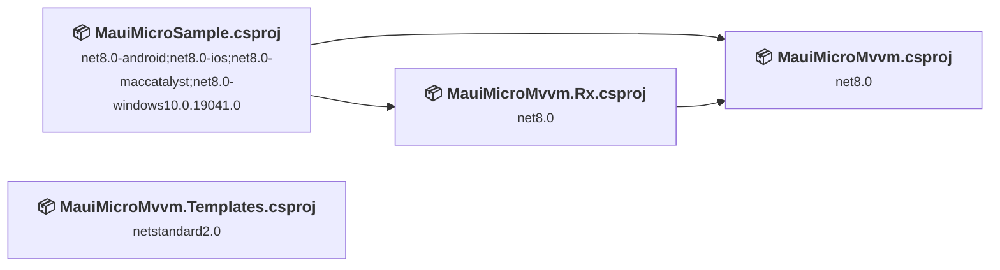
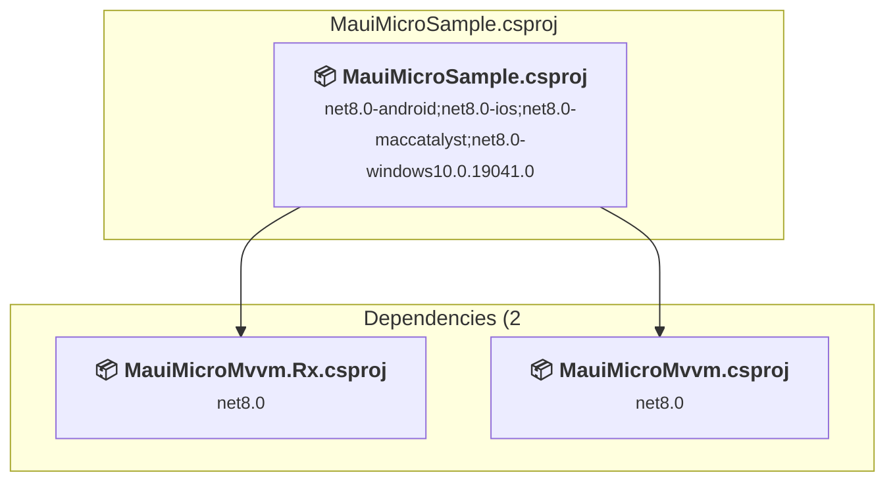
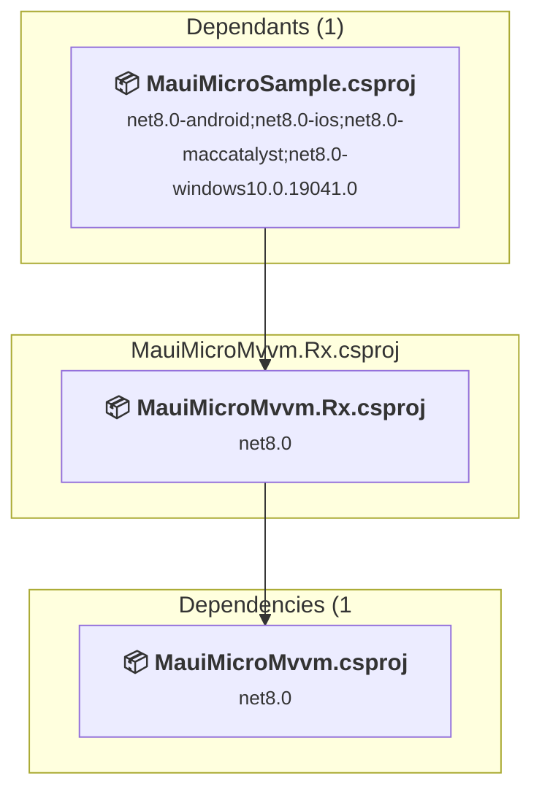
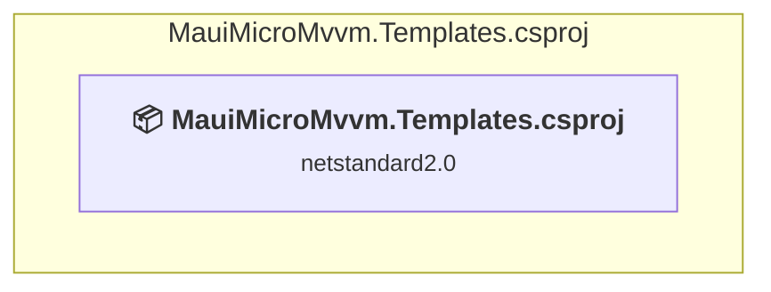
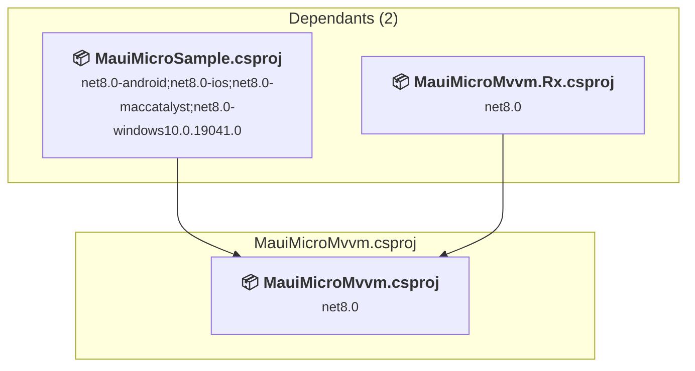

# Projects and dependencies analysis

This document provides a comprehensive overview of the projects and their dependencies in the context of upgrading to .NETCoreApp,Version=v10.0.

## Table of Contents

- [Executive Summary](#executive-Summary)
  - [Highlevel Metrics](#highlevel-metrics)
  - [Projects Compatibility](#projects-compatibility)
  - [Package Compatibility](#package-compatibility)
  - [API Compatibility](#api-compatibility)
- [Aggregate NuGet packages details](#aggregate-nuget-packages-details)
- [Top API Migration Challenges](#top-api-migration-challenges)
  - [Technologies and Features](#technologies-and-features)
  - [Most Frequent API Issues](#most-frequent-api-issues)
- [Projects Relationship Graph](#projects-relationship-graph)
- [Project Details](#project-details)

  - [sample\MauiMicroSample\MauiMicroSample.csproj](#samplemauimicrosamplemauimicrosamplecsproj)
  - [src\MauiMicroMvvm.Rx\MauiMicroMvvm.Rx.csproj](#srcmauimicromvvmrxmauimicromvvmrxcsproj)
  - [src\MauiMicroMvvm.Templates\MauiMicroMvvm.Templates.csproj](#srcmauimicromvvmtemplatesmauimicromvvmtemplatescsproj)
  - [src\MauiMicroMvvm\MauiMicroMvvm.csproj](#srcmauimicromvvmmauimicromvvmcsproj)

## Executive Summary

### Highlevel Metrics

| Metric | Count | Status |
| :--- | :---: | :--- |
| Total Projects | 4 | 3 require upgrade |
| Total NuGet Packages | 7 | 2 need upgrade |
| Total Code Files | 52 |  |
| Total Code Files with Incidents | 3 |  |
| Total Lines of Code | 1483 |  |
| Total Number of Issues | 5 |  |
| Estimated LOC to modify | 0+ | at least 0.0% of codebase |

### Projects Compatibility

| Project | Target Framework | Difficulty | Package Issues | API Issues | Est. LOC Impact | Description |
| :--- | :---: | :---: | :---: | :---: | :---: | :--- |
| [sample\MauiMicroSample\MauiMicroSample.csproj](#samplemauimicrosamplemauimicrosamplecsproj) | net8.0-android;net8.0-ios;net8.0-maccatalyst;net8.0-windows10.0.19041.0 | 🟢 Low | 2 | 0 |  | DotNetCoreApp, Sdk Style = True |
| [src\MauiMicroMvvm.Rx\MauiMicroMvvm.Rx.csproj](#srcmauimicromvvmrxmauimicromvvmrxcsproj) | net8.0 | 🟢 Low | 0 | 0 |  | ClassLibrary, Sdk Style = True |
| [src\MauiMicroMvvm.Templates\MauiMicroMvvm.Templates.csproj](#srcmauimicromvvmtemplatesmauimicromvvmtemplatescsproj) | netstandard2.0 | ✅ None | 0 | 0 |  | ClassLibrary, Sdk Style = True |
| [src\MauiMicroMvvm\MauiMicroMvvm.csproj](#srcmauimicromvvmmauimicromvvmcsproj) | net8.0 | 🟢 Low | 0 | 0 |  | ClassLibrary, Sdk Style = True |

### Package Compatibility

| Status | Count | Percentage |
| :--- | :---: | :---: |
| ✅ Compatible | 5 | 71.4% |
| ⚠️ Incompatible | 0 | 0.0% |
| 🔄 Upgrade Recommended | 2 | 28.6% |
| ***Total NuGet Packages*** | ***7*** | ***100%*** |

### API Compatibility

| Category | Count | Impact |
| :--- | :---: | :--- |
| 🔴 Binary Incompatible | 0 | High - Require code changes |
| 🟡 Source Incompatible | 0 | Medium - Needs re-compilation and potential conflicting API error fixing |
| 🔵 Behavioral change | 0 | Low - Behavioral changes that may require testing at runtime |
| ✅ Compatible | 0 |  |
| ***Total APIs Analyzed*** | ***0*** |  |

## Aggregate NuGet packages details

| Package | Current Version | Suggested Version | Projects | Description |
| :--- | :---: | :---: | :--- | :--- |
| Microsoft.Extensions.Logging.Console | 8.0.0 | 10.0.1 | [MauiMicroSample.csproj](#samplemauimicrosamplemauimicrosamplecsproj) | NuGet package upgrade is recommended |
| Microsoft.Maui.Controls |  |  | [MauiMicroSample.csproj](#samplemauimicrosamplemauimicrosamplecsproj) | ✅Compatible |
| Microsoft.Maui.Controls | 8.0.3 |  | [MauiMicroMvvm.csproj](#srcmauimicromvvmmauimicromvvmcsproj) | ✅Compatible |
| Microsoft.SourceLink.GitHub | 8.0.0 |  | [MauiMicroMvvm.csproj](#srcmauimicromvvmmauimicromvvmcsproj) [MauiMicroMvvm.Rx.csproj](#srcmauimicromvvmrxmauimicromvvmrxcsproj) [MauiMicroMvvm.Templates.csproj](#srcmauimicromvvmtemplatesmauimicromvvmtemplatescsproj) [MauiMicroSample.csproj](#samplemauimicrosamplemauimicrosamplecsproj) | ✅Compatible |
| Nerdbank.GitVersioning | 3.6.133 |  | [MauiMicroMvvm.csproj](#srcmauimicromvvmmauimicromvvmcsproj) [MauiMicroMvvm.Rx.csproj](#srcmauimicromvvmrxmauimicromvvmrxcsproj) [MauiMicroMvvm.Templates.csproj](#srcmauimicromvvmtemplatesmauimicromvvmtemplatescsproj) [MauiMicroSample.csproj](#samplemauimicrosamplemauimicrosamplecsproj) | ✅Compatible |
| ReactiveUI | 20.1.63 |  | [MauiMicroMvvm.Rx.csproj](#srcmauimicromvvmrxmauimicromvvmrxcsproj) | ✅Compatible |
| Refit | 7.0.0 | 9.0.2 | [MauiMicroSample.csproj](#samplemauimicrosamplemauimicrosamplecsproj) | NuGet package contains security vulnerability |

## Top API Migration Challenges

### Technologies and Features

| Technology | Issues | Percentage | Migration Path |
| :--- | :---: | :---: | :--- |

### Most Frequent API Issues

| API | Count | Percentage | Category |
| :--- | :---: | :---: | :--- |

## Projects Relationship Graph

Legend:
📦 SDK-style project
⚙️ Classic project

## Project Details

### sample\MauiMicroSample\MauiMicroSample.csproj

#### Project Info

- **Current Target Framework:** net8.0-android;net8.0-ios;net8.0-maccatalyst;net8.0-windows10.0.19041.0
- **Proposed Target Framework:** net8.0-android;net8.0-ios;net8.0-maccatalyst;net8.0-windows10.0.19041.0;net10.0-windows
- **SDK-style**: True
- **Project Kind:** DotNetCoreApp
- **Dependencies**: 2
- **Dependants**: 0
- **Number of Files**: 26
- **Number of Files with Incidents**: 1
- **Lines of Code**: 474
- **Estimated LOC to modify**: 0+ (at least 0.0% of the project)

#### Dependency Graph

Legend:
📦 SDK-style project
⚙️ Classic project

### API Compatibility

| Category | Count | Impact |
| :--- | :---: | :--- |
| 🔴 Binary Incompatible | 0 | High - Require code changes |
| 🟡 Source Incompatible | 0 | Medium - Needs re-compilation and potential conflicting API error fixing |
| 🔵 Behavioral change | 0 | Low - Behavioral changes that may require testing at runtime |
| ✅ Compatible | 0 |  |
| ***Total APIs Analyzed*** | ***0*** |  |

### src\MauiMicroMvvm.Rx\MauiMicroMvvm.Rx.csproj

#### Project Info

- **Current Target Framework:** net8.0
- **Proposed Target Framework:** net10.0
- **SDK-style**: True
- **Project Kind:** ClassLibrary
- **Dependencies**: 1
- **Dependants**: 1
- **Number of Files**: 3
- **Number of Files with Incidents**: 1
- **Lines of Code**: 103
- **Estimated LOC to modify**: 0+ (at least 0.0% of the project)

#### Dependency Graph

Legend:
📦 SDK-style project
⚙️ Classic project

### API Compatibility

| Category | Count | Impact |
| :--- | :---: | :--- |
| 🔴 Binary Incompatible | 0 | High - Require code changes |
| 🟡 Source Incompatible | 0 | Medium - Needs re-compilation and potential conflicting API error fixing |
| 🔵 Behavioral change | 0 | Low - Behavioral changes that may require testing at runtime |
| ✅ Compatible | 0 |  |
| ***Total APIs Analyzed*** | ***0*** |  |

### src\MauiMicroMvvm.Templates\MauiMicroMvvm.Templates.csproj

#### Project Info

- **Current Target Framework:** netstandard2.0✅
- **SDK-style**: True
- **Project Kind:** ClassLibrary
- **Dependencies**: 0
- **Dependants**: 0
- **Number of Files**: 0
- **Lines of Code**: 0
- **Estimated LOC to modify**: 0+ (at least 0.0% of the project)

#### Dependency Graph

Legend:
📦 SDK-style project
⚙️ Classic project

### API Compatibility

| Category | Count | Impact |
| :--- | :---: | :--- |
| 🔴 Binary Incompatible | 0 | High - Require code changes |
| 🟡 Source Incompatible | 0 | Medium - Needs re-compilation and potential conflicting API error fixing |
| 🔵 Behavioral change | 0 | Low - Behavioral changes that may require testing at runtime |
| ✅ Compatible | 0 |  |
| ***Total APIs Analyzed*** | ***0*** |  |

### src\MauiMicroMvvm\MauiMicroMvvm.csproj

#### Project Info

- **Current Target Framework:** net8.0
- **Proposed Target Framework:** net10.0
- **SDK-style**: True
- **Project Kind:** ClassLibrary
- **Dependencies**: 0
- **Dependants**: 2
- **Number of Files**: 23
- **Number of Files with Incidents**: 1
- **Lines of Code**: 906
- **Estimated LOC to modify**: 0+ (at least 0.0% of the project)

#### Dependency Graph

Legend:
📦 SDK-style project
⚙️ Classic project

### API Compatibility

| Category | Count | Impact |
| :--- | :---: | :--- |
| 🔴 Binary Incompatible | 0 | High - Require code changes |
| 🟡 Source Incompatible | 0 | Medium - Needs re-compilation and potential conflicting API error fixing |
| 🔵 Behavioral change | 0 | Low - Behavioral changes that may require testing at runtime |
| ✅ Compatible | 0 |  |
| ***Total APIs Analyzed*** | ***0*** |  |

